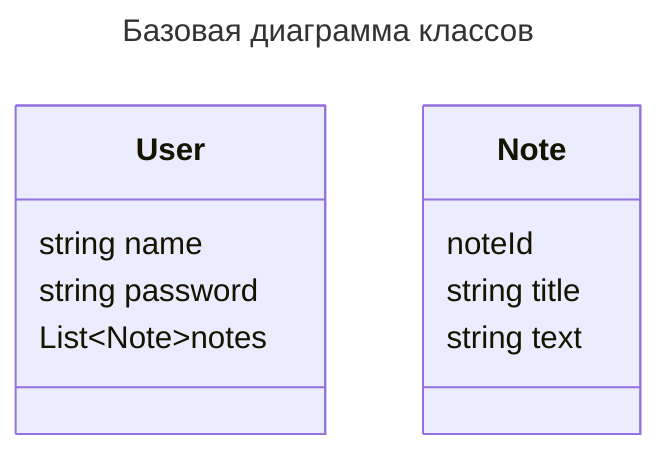

# Тестовое задание на backend разработчика

## Общее описание

В некоторую систему обращаются пользователи. Пользователи могут работать с заметками. Заметка представляет собой текст, состоящий из заголовка и основного текста, а также уникального идентификатора. Длина текста не должна превышать 500 символов. Текст хранится в UTF-8. 

Функционал пользователя:
* Добавить заметку.
* Удалить существующую заметку по номеру.
* Удалить все заметки.
* Получить заметку по номеру.
* Получить все заметки.

Прежде сделать какое-либо действие пользователь должен авторизоваться. Авторизация должна происходить через [JWT](https://www.rfc-editor.org/rfc/rfc7519).

Пользователей должен иметь возможность:
* Самостоятельно зарегистрироваться (создать аккаунт).
* Удалить свой аккаунт.
* Поменять пароль.
* Выполнить выход из своего аккаунта.

При удалении пользователи все его заметки должны быть также удалены.

Необходимо разработать API, состоящий из двух частей:
1. API авторизации.
2. API для работы с заметками.

Все данные должны храниться в БД. Пароли не должны храниться в явном виде. Для этого предоставлен пример запуска PostgreSQL в [docker-compose.yaml](docker-compose.yaml)

Для простоты можно всё реализовать в рамках одного приложения. 

Приложение должно быть представлено в виде пакета для Python с тестами.

Покрытие тестами должно быть **не менее 80 %.**

## Описание данных

Базовая модель данных для пользователей и заметок приведена на диаграмме классов ниже:

## Решение

В качестве решения необходимо прислать модифицированный [docker-compose.yaml](docker-compose.yaml), который запустит тесты и выведет отчёт о покрытии. Можно прислать:
* Ссылку на репозиторий.
* Архив с необходимыми файлами.

Во время сборки финального образа приложение должно устанавливаться внутрь контейнера как любой другой пакет для Python.  

## Основные критерии оценки выполнения заданий

* Код написан в едином стиле.
* Покрытие тестами.
* Как организована работа с БД.
* Соблюдены основные соглашения, принятые в сообществе. Например, PEP 8 для Python. Стиль может быть разным, но весь код должен быть оформлен в едином стиле.
* Как организована структура проекта и API.
* В части Docker. Насколько оптимально написана сборка с точки зрения размера образа и сколько инструкций будут выполняться в случае изменения основного кода приложения (если всё собирается заново, то это не очень хорошо). [Основные моменты смотрите в документации](https://docs.docker.com/develop/develop-images/dockerfile_best-practices/)